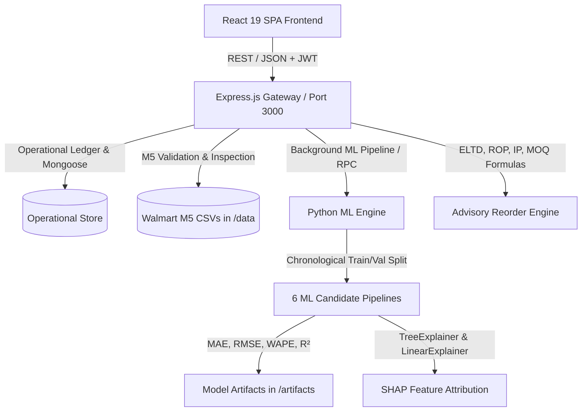

# Explainable AI-Powered Smart Warehouse Inventory Optimization and Demand Forecasting System for Sustainable E-Commerce Supply Chains

An academic B.Tech CSE decision-support platform designed to forecast multi-period retail demand using the developer-supplied Walmart M5 dataset, benchmark six machine learning candidate models, explain predictions using SHAP (SHapley Additive exPlanations), and provide human-in-the-loop inventory optimization and stockout-risk prevention aligned with UN Sustainable Development Goals (SDG 9 & SDG 12).

---

## 1. System Architecture



---

## 2. Core Modules

1. **Executive Dashboard**: Real-time KPI summaries, stockout risk vulnerabilities, active production forecasting model status, recent movements ledger audit, and dataset integrity status.
2. **Walmart M5 Dataset Protocol**: Strict validation of `sales_train_validation.csv`, `calendar.csv`, and `sell_prices.csv`. Enforces anti-substitution policy—synthetic sales data is strictly prohibited.
3. **6-Candidate Model Comparison**: Empirical benchmarks comparing:
   - Linear Regression (Baseline)
   - ARIMA (Time-Series Baseline)
   - Prophet (Trend & Multi-Seasonality)
   - XGBoost (Extreme Gradient Boosted Trees)
   - LightGBM (Light Gradient Boosting Machine)
   - CatBoost (Categorical Boosting)
4. **Demand Forecast Explorer**: Historical actual point-of-sale data (28 days) plotted against future forecasted demand timelines with 95% confidence intervals across configurable horizons (7–28 days).
5. **SHAP Explainability (XAI)**: Global feature importance (Mean |SHAP|) and local per-prediction waterfall attributions ($f(x) = E[y] + \sum \phi_i$). Transparent academic disclosures distinguishing statistical model attribution from real-world causation.
6. **Product Master & Operational Inventory**: Live stock levels, safety stocks, inbound receipts, committed reservations, and physical warehouse bin locations. Seeded operational records are explicitly marked **SYNTHETIC DEMONSTRATION DATA** and separated from training sets.
7. **Inventory Movements Ledger**: Immutable append-only audit trail recording stock-in, dispatch, cycle count adjustments, and customer returns.
8. **Alerts & Advisory Reorder Engine**: Human-in-the-loop decision-support calculations:
   - $\text{ExpectedLeadTimeDemand} = \sum_{t=1}^L \hat{y}_t$
   - $\text{ReorderPoint} = \text{ELTD} + \text{SafetyStock}$
   - $\text{InventoryPosition} = \text{OnHand} + \text{ConfirmedInbound} - \text{CommittedDemand}$
   - $\text{SuggestedBaseOrderQty} = \max(0, \text{ROP} - \text{IP})$
   - Final vendor order quantity adjusted for Supplier MOQ and Pack Size multipliers.
9. **Supplier Directory**: Procurement parameters including supplier lead times (days), minimum order quantities (MOQ), and packaging units.
10. **Audit Logs & Export Center**: Administrative audit trail and authorized CSV exports for inventory, movements, reorders, and model metrics.

---

## 3. Technology Stack

- **Frontend**: React 19, Vite, Tailwind CSS v4, Lucide React icons.
- **Backend**: Node.js, Express.js, TypeScript, Mongoose/MongoDB support, JWT authentication, bcryptjs password hashing.
- **Machine Learning Engine**: Python 3.11, pandas, NumPy, scikit-learn, statsmodels, XGBoost, LightGBM, CatBoost, SHAP, pytest.
- **Environment**: Express mounted with Vite middlewares running on port 3000.

---

## 4. Dataset Directory & Configuration

### File Placement:
Place developer-supplied Walmart M5 Forecasting competition files in the `data/` directory at the project root:
```
data/
  ├── sales_train_validation.csv   # Primary training file (d_1 to d_1913)
  ├── calendar.csv                 # Date calendar, events, SNAP flags
  ├── sell_prices.csv              # Store/item weekly sell prices
  └── sales_train_evaluation.csv   # (Optional) Extended evaluation through d_1941
```

### Path Resolution:
The application resolves relative paths against the project root directory:
```bash
DATASET_DIR=./data
```
The internal engine converts relative paths into verified absolute filesystem paths. If files are missing, training and forecasting are blocked with clear remediation instructions.

---

## 5. Seed Accounts & Roles

The system enforces server-side Role-Based Access Control (RBAC):

| Role | Username | Password | Permissions |
| :--- | :--- | :--- | :--- |
| **System Administrator** | `admin` | `AdminPassword123!` | Full control: Users, Model promotion, Dataset path configuration, Settings, Audit logs, Inventory |
| **Warehouse Manager** | `manager` | `ManagerPassword123!` | Operational access: Stock movements, Ledger, Alert review, Reorder sign-off, Forecast explorer, CSV exports |

*1-Click demo buttons are available on the sign-in modal for quick role testing.*

---

## 6. Setup & Execution Commands

### Installation:
```bash
# 1. Install Node.js dependencies
npm install

# 2. Install Python ML dependencies
pip3 install fastapi uvicorn pydantic pandas numpy scikit-learn statsmodels xgboost lightgbm pytest httpx
```

### Start Application (Port 3000):
```bash
npm run dev
```

### Run Python Tests:
```bash
PYTHONPATH=ml-service python3 -m pytest ml-service/tests
```

### Build for Production:
```bash
npm run build
npm start
```
