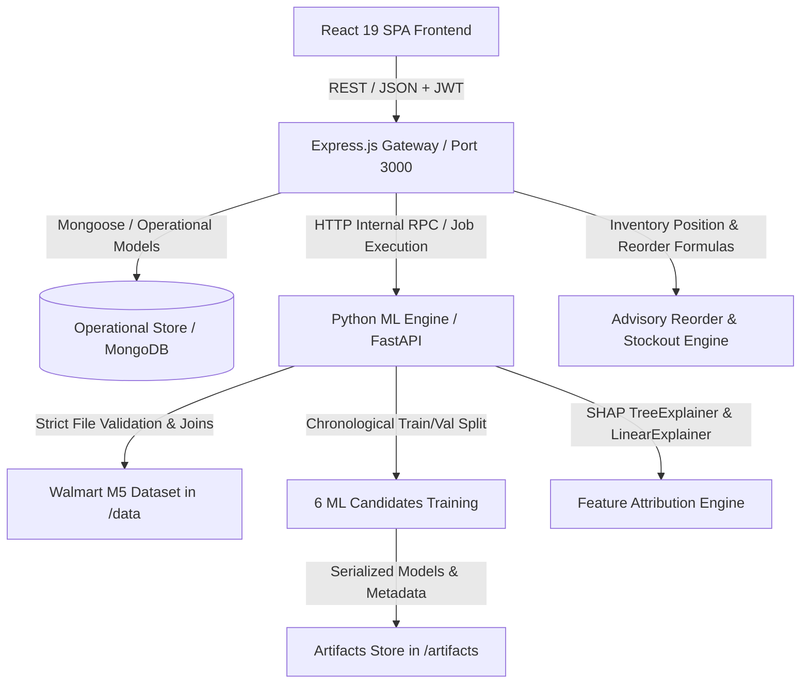

# System Architecture & Technical Specifications

## 1. System Overview
The **Explainable AI-Powered Smart Warehouse Inventory Optimization and Demand Forecasting System** is designed for sustainable e-commerce supply chains. It bridges the gap between machine learning demand forecasting and operational inventory management through an explainable, decision-support interface.

## 2. Core Service Components

### A. Frontend Layer (React + Vite + Tailwind CSS)
- Single-page application with modular, accessible interface.
- Real-time status indicators, KPI metric cards, interactive forecasting chart (historical actuals vs forecasted timeline with confidence bounds).
- Global SHAP feature importance charts and local per-prediction waterfall attribution breakdown.
- Strict anti-AI slop design: clean typography, domain-tailored color accents (slate, indigo, emerald, amber, rose), zero-pill metadata discipline, high-density operational data tables.

### B. Backend Layer (Node.js + Express)
- Serves Vite dev middleware or production bundle on Port 3000.
- Implements comprehensive REST API under `/api/v1`.
- Authentication & Role-Based Access Control (RBAC):
  - **Admin**: Full administrative permissions (users, model promotion, path settings, audit logs).
  - **Warehouse Manager**: Operational workflows (stock movements, alerts review, export reports).
- Operational data persistence: Products, Suppliers, Inventory Movements Ledger, Audit Logs.
- Decision-support inventory optimization engine:
  - Expected lead time demand: $\text{ELTD} = \sum_{t=1}^{\text{lead\_time}} \hat{y}_t$
  - Reorder Point: $\text{ROP} = \text{ELTD} + \text{SafetyStock}$
  - Inventory Position: $\text{IP} = \text{OnHand} + \text{Inbound} - \text{Committed}$
  - Suggested Order Quantity: $\max(0, \text{ROP} - \text{IP})$ with MOQ and Pack Size rounding.

### C. ML Service & Pipeline (Python + FastAPI)
- Strict dataset validator for M5 dataset (`sales_train_validation.csv`, `calendar.csv`, `sell_prices.csv`).
- Leakage-safe feature engineering pipeline (chronological splitting, lag features, rolling statistics, event encodings, price dynamics).
- 6 Forecasting algorithms:
  1. Linear Regression (baseline)
  2. ARIMA (time-series baseline)
  3. Prophet (trend & seasonality candidate)
  4. XGBoost (gradient boosted decision trees)
  5. LightGBM (light gradient boosting machine)
  6. CatBoost (categorical gradient boosted trees)
- Unified metric evaluation: MAE, RMSE, WAPE, $R^2$, and latency.
- Explainability via SHAP (TreeExplainer and LinearExplainer).

### D. Separation of Operational Data vs Training Data
- Historical sales for forecasting strictly originate from the Walmart M5 dataset.
- Live operational inventory (on-hand quantities, lead times, safety stocks) is managed in a separate operational ledger.
- Seeded operational records are explicitly marked **SYNTHETIC DEMONSTRATION DATA** and never fed into model training.
